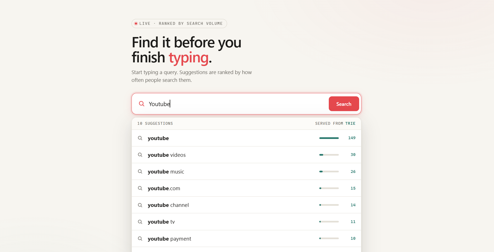
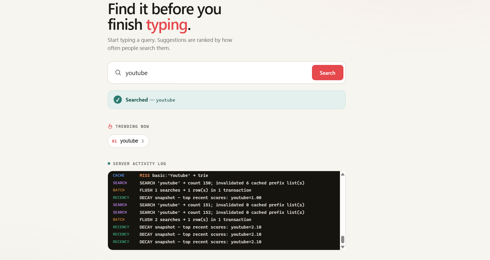

# 🔎 Search Typeahead System

A search-as-you-type engine — the autocomplete box you see on Google, Amazon, and
content platforms — built to showcase the **backend data-system design** rather
than just a UI. As you type a prefix, it returns the most popular matching queries
in milliseconds; as people search, popularity updates and *trending* queries rise.

The interesting parts are all under the hood. The data structures and routing
logic are **hand-written so every decision is explainable** — the consistent-hash
ring, the trie, the batch writer are all ours, not a library doing the hard work:

- a **trie** with precomputed top-K for sub-millisecond prefix lookups,
- a **distributed cache** across three real **Redis** nodes, sharded with a
  hand-written **consistent-hashing** ring (virtual nodes),
- **recency-aware ranking** that surfaces trending queries without letting old
  spikes dominate forever,
- a **batch writer** that collapses thousands of searches into a handful of DB
  writes.

> **Measured (200k ORCAS queries, 3 real Redis nodes):** ~6.5 ms p95 suggestion
> latency · ~97% cache hit rate · ~99.6% fewer DB writes via batching · only ~1/N
> keys remapped when a cache node is added/removed.
> Full report in [PERFORMANCE.md](PERFORMANCE.md).

---

## Table of contents

- [What it does](#what-it-does)
- [Quick start](#quick-start)
- [Screenshots](#screenshots)
- [How it works](#how-it-works)
- [Project layout](#project-layout)
- [Dataset](#dataset)
- [API reference](#api-reference)
- [Measuring performance](#measuring-performance)
- [Design docs](#design-docs)
- [Rubric mapping](#rubric-mapping)
- [Troubleshooting](#troubleshooting)

---

## What it does

| Capability | Where it lives | One-line summary |
|---|---|---|
| Prefix suggestions, top-10 by popularity | `trie.py` | Walk to the prefix node, return its precomputed top-K. |
| Distributed cache + consistent hashing | `ring.py`, `redis_cache.py`, `cache_cluster.py` | Each prefix is owned by a Redis node chosen on a hash ring. |
| Search submission + count updates | `main.py`, `datastore.py` | `POST /search` returns a dummy response and bumps counts. |
| Trending / recency-aware ranking | `trending.py` | Blends all-time popularity with time-decayed recent activity. |
| Batch writes | `batch_writer.py` | Buffer → aggregate duplicates → flush in one transaction. |
| Single-page UI | `ui/index.html` | Debounced search box, ranked dropdown, trending, keyboard nav. |

---

## Quick start

The cache is backed by **three real, independent Redis nodes**, so the recommended
way to run everything is Docker Compose — one command brings up the app and all
three cache nodes together.

**Requirements:** Docker + Docker Compose.

```bash
docker compose up --build
#  →  app + UI at http://localhost:8000/
#  →  three Redis cache nodes on ports 6379 / 6380 / 6381
```

The app's own **consistent-hash ring** decides which Redis node owns each prefix;
Redis just stores that node's cached suggestion lists (with native TTL). Verify
the cache is live:

```bash
curl "http://localhost:8000/cache/stats"     # "backend":"redis", 3 node endpoints
```

The dataset is loaded into SQLite automatically when the image builds.

### Running without Docker (own Redis instances)

If you'd rather run the app process directly, start three Redis servers yourself
(ports 6379/6380/6381) and point the app at them:

```bash
pip install -r requirements.txt
python data/load_data.py --reset
REDIS_NODES=127.0.0.1:6379,127.0.0.1:6380,127.0.0.1:6381 \
  python -m uvicorn app.main:app --port 8000
#  →  http://127.0.0.1:8000/
```

> **Why three separate Redis nodes?** The assignment grades a *distributed* cache
> using consistent hashing. Three independent Redis processes make the distribution
> real (genuinely separate nodes the app routes between), while the routing logic —
> the consistent-hash ring with virtual nodes — is ours and fully explainable. See
> [ARCHITECTURE.md](ARCHITECTURE.md) §4.

---

## Screenshots

<!-- Replace these placeholders with real images saved under docs/screenshots/. -->

**Typeahead suggestions** — ranked dropdown as you type a prefix:



**Trending searches** — recency-ranked chips, independent of all-time popularity:


**Cache routing (`/cache/debug`)** — which Redis node owns a prefix, hit/miss, and
the even key distribution across nodes:



---

## How it works

### Read path — `GET /suggest`
```
prefix ─► consistent-hash ring ─► owning cache node
                                      │
                          ┌───────────┴───────────┐
                       HIT │                       │ MISS
                          ▼                        ▼
                 return cached list      trie.suggest() ─► cache.set(TTL) ─► return
                 (source = "cache")               (source = "trie")
```

### Write path — `POST /search`
```
POST /search ─► record_search():
                  • trie.bump()        → suggestions reflect the search instantly
                  • batch.enqueue()    → DB write is deferred + aggregated
                  • trending.record()  → recency signal for enhanced ranking
                  • cache.invalidate() → affected prefixes (both ranking modes)
                                              │
                  batch writer flushes on size OR timer
                                              ▼
                         SQLite — one transaction per batch (source of truth)
```

The single `record_search()` choke-point is why batching could be added late
without touching the endpoint or the response contract. Full diagram and rationale
in [ARCHITECTURE.md](ARCHITECTURE.md).

---

## Project layout

```
app/
  main.py            FastAPI app — endpoints + wiring of every component
  datastore.py       SQLite source of truth (query, count, last_searched_at)
  trie.py            in-memory prefix index with per-node cached top-K
  ring.py            consistent-hash ring (md5, virtual nodes)
  redis_cache.py     one cache node backed by a real Redis instance (+ TTL, stats)
  cache_cluster.py   N Redis nodes behind the ring + invalidation + stats
  trending.py        recency tracking (time buckets) + decay-based blended score
  batch_writer.py    buffer → aggregate → flush (size/timer) + write metrics
data/
  queries.csv        the active dataset (query,count) — ORCAS top-200k
  prepare_orcas.py   aggregate raw ORCAS click logs → top-N query,count CSV
  load_data.py       CSV → SQLite loader (normalizes columns; aggregates if needed)
ui/
  index.html         single-page UI (debounce, dropdown, keyboard nav, trending)
bench/
  benchmark.py       latency p50/p95/p99, cache hit rate, write reduction
README.md            this file
ARCHITECTURE.md      diagram, design choices, and trade-offs
PERFORMANCE.md       measured numbers + how to reproduce them
```

---

## Dataset

**ORCAS — real Bing search-query logs (Microsoft / TREC).**
[ORCAS](https://microsoft.github.io/msmarco/ORCAS) (Open Resource for Click
Analysis in Search) is **18.8 million real Bing query–click records**. It's the
strongest possible fit for a *search* typeahead — these are literally search
queries — with a clean provenance story: *frequency = how often a query's results
were clicked.*

The raw `orcas.tsv` is one row **per click** (`qid, query, did, url`), so we
**derive per-query counts by aggregation** (how the assignment allows count-less
datasets to be handled). [`data/prepare_orcas.py`](data/prepare_orcas.py)
aggregates clicks per query, filters junk, and keeps the top-N:

```bash
# 1. download ORCAS (the "Click data" file, ~330 MB gz) from the link above
#    https://microsoft.github.io/msmarco/ORCAS  →  orcas.tsv.gz  →  gunzip it
# 2. aggregate 18.8M clicks → per-query frequency, keep the top 200k:
python data/prepare_orcas.py /path/to/orcas.tsv --top 200000
# 3. load into SQLite:
python data/load_data.py --reset
```

This produced the active dataset: **200,000 queries**, e.g. `weather` (2,116
clicks), `youtube`, `facebook`, `google maps`, `how to get a passport`. The prep
script handles both ORCAS variants (the click-log form where frequency =
rows-per-query, and any pre-counted form) and writes the `query,count` schema the
loader expects — no other code changes.

> **Running with Docker?** Re-run `prepare_orcas.py` + `load_data.py` to refresh
> `data/queries.csv`, then `docker compose up --build` — the image loads the
> dataset into SQLite at build time, so a rebuild is needed to pick up new data.

**Schema** (the only thing the loader needs):

```csv
query,count
weather,2116
mapquest,1412
weather forecast,1239
youtube,149
...
```

**Using a different CSV** (another ORCAS top-N, a Kaggle export, etc.) — the
loader normalizes column names, so no code changes are needed:

```bash
python data/load_data.py path/to/your_file.csv --reset
```

- **Query column** is auto-detected from: `query, search_term, search_query,
  keyword, term, title, product_name, name`.
- **Count column** is auto-detected from: `count, frequency, freq, popularity,
  searches, search_count, views, rating_count`.
- **No count column?** The loader **derives counts by aggregation** (`GROUP BY
  query`) — the row frequency becomes the count. This is the approach the
  assignment explicitly permits for count-less datasets.

`load_data.py` upserts (adds counts on conflict), so loading the sample and then
the full file accumulates rather than overwriting.

---

## API reference

Base URL: `http://127.0.0.1:8000`

### `GET /suggest`
Up to 10 prefix-matching suggestions.

| Param | Default | Description |
|---|---|---|
| `q` | `""` | The typed prefix (case-insensitive). |
| `mode` | `basic` | `basic` = sort by all-time count · `enhanced` = recency-aware. |

```bash
curl "http://127.0.0.1:8000/suggest?q=weath&mode=basic"
```
```json
{
  "query": "weath",
  "mode": "basic",
  "count": 10,
  "suggestions": [
    { "query": "weather",          "score": 2369 },
    { "query": "weather forecast", "score": 1239 }
  ],
  "source": "cache",
  "owner_node": "cache-node-0"
}
```
`source` is `cache` (hit), `trie` (miss → recomputed), or `none` (empty prefix).
In `enhanced` mode each suggestion also includes `count` and `recent` so you can
see *why* it ranked where it did. Empty / whitespace / unmatched prefixes return
an empty list with HTTP 200 (handled gracefully, never an error).

### `POST /search`
Submit a search: returns the dummy response and records the query.

```bash
curl -X POST http://127.0.0.1:8000/search \
     -H "Content-Type: application/json" -d '{"query":"weather"}'
```
```json
{ "message": "Searched", "query": "weather", "count": 2370 }
```
New queries are inserted with an initial count; existing ones are incremented.
The update is reflected in `/suggest` immediately and persisted via batching.

### `GET /trending?limit=<n>`
Top queries by recent (time-decayed) activity — independent of all-time count.
```json
{ "trending": [ { "query": "weather", "score": 1.0 } ], "window_seconds": 180 }
```

### `GET /cache/debug?prefix=<p>`
Shows consistent-hashing routing for a prefix.
```json
{
  "prefix": "iph", "normalized_key": "iph",
  "ring_position": 2952454930,
  "owner_node": "cache-node-2",
  "status": "miss",
  "all_nodes": ["cache-node-0", "cache-node-1", "cache-node-2"],
  "sample_distribution": { "cache-node-0": 3, "cache-node-1": 5, "cache-node-2": 8 }
}
```

### `GET /cache/stats`
Per-node and overall cache hit rate (used in the performance report).

### `GET /batch/stats`
Write-reduction evidence.
```json
{
  "searches_enqueued": 3303,
  "db_flushes": 9,
  "actual_db_transactions": 9,
  "naive_synchronous_writes": 3303,
  "write_reduction_ratio": 0.9973
}
```

### `POST /batch/flush`
Force a flush now (handy in demos so buffered counts hit SQLite immediately).

### `GET /health`
Liveness — queries loaded and active cache nodes.

---

## Measuring performance

With the server running in one terminal:

```bash
python bench/benchmark.py --base http://127.0.0.1:8000
# optional: --iters 2000 --searches 3000
```

It reports suggestion latency (p50/p95/p99, cold vs warm), cache hit rate, write
reduction from batching, and the consistent-hashing key distribution. It uses only
the standard library, so there is nothing extra to install.

> Note: the benchmark submits searches, which mutates the SQLite counts. Reset
> anytime with `python data/load_data.py --reset`.

Captured results and discussion: [PERFORMANCE.md](PERFORMANCE.md).

---

## Design docs

[ARCHITECTURE.md](ARCHITECTURE.md) is the deep dive: full architecture diagram,
the reason behind every component, the trending scoring/windowing math, the
batch-write failure trade-offs, and known limitations.

---

## Rubric mapping

Where each graded requirement is satisfied, for quick verification.

| Requirement | Marks | Implementation | Evidence |
|---|---|---|---|
| Dataset ingestion | — | `data/load_data.py` + `data/queries.csv` | `GET /health` shows queries loaded |
| Search UI + suggestions dropdown | — | `ui/index.html` | open `/` |
| Suggestions API (top-10, prefix, by count) | — | `GET /suggest`, `trie.py` | API reference above |
| Search API + query-count updates | — | `POST /search`, `datastore.py` | returns `{"message":"Searched"}` |
| **Distributed cache + consistent hashing** | **60** | `ring.py`, `cache_cluster.py` | `GET /cache/debug`, PERFORMANCE §4 |
| **Trending searches** (recency + explanation) | **20** | `trending.py`, `mode=enhanced` | demo step 5, ARCHITECTURE §5 |
| **Batch writes** (+ failure trade-off) | **20** | `batch_writer.py` | `GET /batch/stats`, ARCHITECTURE §6 |
| Latency / hit-rate / write-reduction report | — | `bench/benchmark.py` | PERFORMANCE.md |
| Consistent-hashing behavior explanation | — | ARCHITECTURE §4 | 32.7% vs ~67% remap |

---

## Troubleshooting

| Symptom | Fix |
|---|---|
| `trie is empty` warning on startup | Run `python data/load_data.py --reset` first. |
| Port 8000 in use | Start with `--port 8800` and open that port. |
| Suggestions look stale after many searches | Counts are batched; force `POST /batch/flush`, or wait for the 2s timer. |
| Trending is empty | It populates only after searches happen — search a few queries. |
| Want a clean dataset again | `python data/load_data.py --reset`. |
